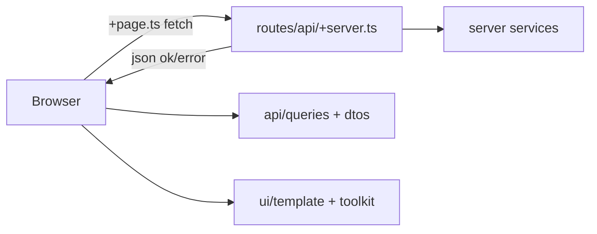

# SvelteKit Web App — Technology Stack Blueprint

Reusable context for scaffolding new full-stack web apps with Cursor. Describes conventions and folder layout — not tied to any single product or domain.

---

## Overview

| Layer           | Choice                                                |
| --------------- | ----------------------------------------------------- |
| Framework       | **SvelteKit 2** + **Svelte 5**                        |
| Language        | **TypeScript**                                        |
| Runtime adapter | **@sveltejs/adapter-node** (Docker / process hosting) |
| Bundler         | **Vite 6**                                            |
| Styling         | **Tailwind CSS 4** + **Skeleton UI 3**                |
| Validation      | **Zod 4**                                             |
| Auth            | Session cookie (JWT), optional OAuth providers        |

---

## Svelte

### Version and patterns

- **Svelte 5** with runes: `$props()`, `$state()`, `$derived()`, `{@render children()}`
- **SvelteKit 2** file-based routing under `src/routes/`
- Preprocessing: `vitePreprocess()` in `svelte.config.js`

### App shell

| File                  | Role                                                |
| --------------------- | --------------------------------------------------- |
| `src/app.html`        | HTML shell (placeholders for `lang`, assets, etc.)  |
| `src/app.css`         | Global styles, Tailwind, design-system theme        |
| `src/hooks.server.ts` | Per-request setup (locale, cookies, `event.locals`) |

### Data loading

| File                | Use for                                             |
| ------------------- | --------------------------------------------------- |
| `+page.server.ts`   | Server-only loads (auth, secrets, filesystem reads) |
| `+page.ts`          | Universal loads (often `fetch('/api/...')`)         |
| `+layout.server.ts` | Shared server data (session user, etc.)             |
| `+layout.ts`        | Client layout setup (i18n init, `waitLocale()`)     |

### Route layout (suggested)

```
src/routes/
├── (app)/              # Main app shell (header, modals, toasts)
│   └── [lang]/         # Optional locale prefix — omit if single-language
├── api/                # JSON REST endpoints (+server.ts)
└── dev/                # Optional dev-only routes (email previews, fixtures)
```

Add route groups as needed (`(auth)/`, `(admin)/`, etc.) without changing the core pattern.

### Context

Root layout can expose shared values via Svelte context:

```svelte
setContext('lang', data.lang); setContext('user', data.user);
```

---

## Tailwind CSS

### Setup (v4)

- Plugin: `@tailwindcss/vite` in `vite.config.ts`
- Entry: `src/app.css` with `@import 'tailwindcss'`
- Optional plugins: `@tailwindcss/forms`, `@tailwindcss/typography`
- Prettier: `prettier-plugin-tailwindcss` for class sorting

### Design system

Define in `src/app.css`:

- **`@theme`** — custom design tokens (fonts, spacing overrides)
- **`[data-theme='app']`** — Skeleton-compatible CSS variables (primary, surface, success, error, …)
- **`@custom-variant dark`** — dark mode via `[data-mode="dark"]` on `<html>`
- Shared component classes: `.card`, `.btn`, `.input`, `.chip`, modal overlays

Set `data-theme="app"` (or your theme name) on `<html>` in `app.html`.

### UI library

**Skeleton UI 3** (`@skeletonlabs/skeleton`, `@skeletonlabs/skeleton-svelte`):

- Toaster, popovers, form primitives
- Import theme in `app.css`

### Typical usage

- Utility classes in templates (`flex`, `gap-4`, `rounded-lg`, …)
- Semantic colors via Skeleton tokens: `bg-primary-500`, `text-surface-900`
- Shared radii/spacing via CSS variables (`--radius-base`, `--radius-container`)

---

## Architecture

Layered structure under `src/lib/`:

```
src/lib/
├── api/           # Shared API contracts (client + server)
├── server/        # Server-only (repos, DB, mail, OAuth, integrations)
├── ui/            # Svelte components
├── emails/        # Transactional email Svelte templates (optional)
├── i18n/          # Localization helpers (optional)
└── shared/        # Isomorphic utilities (constants, slug, paths)
```

### Routes (`src/routes/`)

| Pattern | Example                               | Purpose       |
| ------- | ------------------------------------- | ------------- |
| Page    | `(app)/[lang]/dashboard/+page.svelte` | UI            |
| Load    | `+page.ts` / `+page.server.ts`        | Page data     |
| API     | `api/items/[id]/+server.ts`           | HTTP handlers |
| Layout  | `(app)/+layout.svelte`                | App chrome    |

**Path constants** — centralize in `src/lib/ui/utils/paths.ts`:

```ts
export const DASHBOARD_PAGE = '/[lang]/dashboard';
export const ITEM_PAGE = '/[lang]/items/[id]';
```

Use a `generatePath(template, params)` helper to substitute dynamic segments.

### API (`src/routes/api/` + `src/lib/api/`)

**Server handlers** (`+server.ts`) follow a consistent pipeline:

1. Authenticate when required (session cookie / token)
2. Validate input with Zod schemas from `$lib/api`
3. Delegate to server-side services or data loaders
4. Return `json(ok(data))` or a standardized error via `mapGenericError`

**Client queries** (`src/lib/api/queries/`):

- `apiQuery<P, B>(url, opts)` — returns Svelte stores: `payload`, `error`, `status`, `execute`, `reset`
- One module per resource (e.g. `item.query.ts`) exporting URL constants and typed query factories

**Response shape** (`src/lib/api/index.ts`):

```ts
type ApiResponse<T> =
  | { data: T }
  | { code: ApiErrorEnum; data: { message?: ApiErrorMessage; fields?: ApiFieldError[] } };
```

Errors use i18n message IDs (e.g. `'error.not-found'`) or `{ id, values }` for interpolation.

### Interfaces / DTOs (`src/lib/api/dtos/`)

- **Zod schemas** define validation and TypeScript types (`z.infer<typeof Schema>`)
- Export DTO types (`ItemDto`, `UserDto`) and enums shared across client and server
- Schemas validate API input in `+server.ts` via `.parse(input)` or `.safeParse()`
- `mapZodError()` converts `ZodError` → `ApiFieldError[]` for form feedback

### Repositories (`src/lib/server/repositories/`) _(optional)_

Data-access layer between API handlers and a database or external store.

**One file per aggregate**, e.g.:

```
repositories/
├── users.repo.ts
├── items.repo.ts
├── notifications.repo.ts
└── index.ts          # barrel exports
```

**Conventions:**

- Return **DTOs** — not raw ORM entities
- Export a default object or namespace from `repositories/index.ts`

### UI components (`src/lib/ui/`)

| Folder      | Purpose                         | Examples                                         |
| ----------- | ------------------------------- | ------------------------------------------------ |
| `toolkit/`  | Generic, reusable primitives    | `Button`, `FormTextField`, `Pagination`, `Chip`  |
| `template/` | Domain-specific building blocks | `ItemCard`, `SearchBar`, `DataTable`             |
| `forms/`    | Multi-field form compositions   | `item-form.svelte`, `settings-form.svelte`       |
| `layout/`   | Page structure                  | `page-header.svelte`, `sidebar-layout.svelte`    |
| `modals/`   | Modal system                    | `modal-container.svelte`, `confirm-modal.svelte` |
| `utils/`    | Client helpers                  | `paths.ts`, `forms.ts`, toaster setup            |

Each folder should have an `index.ts` barrel export. Import from `$lib/ui/toolkit`, `$lib/ui/template`, etc.

**Rule of thumb:** if it could ship in any app → `toolkit/`; if it references your domain → `template/` or `forms/`.

### Email templates (`src/lib/emails/`) _(optional)_

- Svelte components under `templates/`
- Shared layout in `toolkit/` (`email-layout.svelte`, `section.svelte`)
- Rendered server-side via a mail module (e.g. `src/lib/server/mail/`)
- Optional dev preview route: `src/routes/dev/emails/`

### Server utilities (`src/lib/server/utils/`)

Typical modules:

- `errors.ts` — `EndPointError`, `mapGenericError`, HTTP status mapping
- `sql.ts` — parameterized raw SQL
- `sanitize.ts` — HTML sanitization for user content and static pages
- Auth helpers (JWT verify, session cookie read/write)

### Shared (`src/lib/shared/`)

Isomorphic code safe on client and server:

- `defaults.ts` — site name, supported languages, session constants
- Utility modules: `slug.ts`, `paths.ts`, attachment helpers, etc.

---

## Language & Localization _(optional)_

Skip this section for single-language apps.

### Stack

- **svelte-i18n** — `register()`, `init()`, `$_()` / `$t()` in components
- Translation files: `src/lang/{locale}.json` (flat dot-notation keys)
- Supported locales and default defined in `src/lib/shared/defaults.ts`

### URL-based locale (recommended when i18n is enabled)

- App routes under `/[lang]/...`
- `hooks.server.ts` resolves language: URL segment → `Accept-Language` header → default
- `locale.set(lang)` per request; inject `lang` into `<html lang="...">`

### Initialization

Root `+layout.ts` imports `$lib/i18n` and awaits `waitLocale()` before rendering.

### Key naming

- UI copy: `settings.page-title`, `items.create-button`
- API errors: `error.not-found`, `error.unauthorized` (returned as message `id`)
- Email copy: dedicated module under `src/lib/emails/i18n.ts`

### Adding a language

1. Add locale code to `supportedLanguages` in `defaults.ts`
2. Create `src/lang/{code}.json`
3. Add localized markdown under `pages/{code}/` if using static content pages
4. Register via `supportedLanguages.forEach` in `src/lib/i18n/index.ts`

---

## Static assets

### `static/` (served at `/`)

Public files copied as-is by Vite/SvelteKit:

```
static/
├── favicon.svg
├── logo.svg
├── fonts/              # Self-hosted web fonts
└── uploads/            # User-generated files (or external storage)
```

Reference as `/fonts/...`, `/logo.svg`, etc.

### Markdown content pages (`pages/`) _(optional)_

Long-form legal or marketing copy kept out of `static/`:

```
pages/
├── en/terms-of-use.md
└── de/privacy-policy.md
```

Load server-side: read file → parse with **marked** (GFM) → sanitize (DOMPurify) → render via `{@html}` in the page component.

A `loadStaticPageMarkdown(lang, slug)` helper in `src/lib/server/static-pages.ts` keeps this DRY.

### File uploads _(optional)_

- Upload handler: `src/routes/api/upload/[target]/+server.ts`
- Image processing: **sharp**
- Storage path and size rules defined in `src/lib/shared/defaults.ts`

---

## Icons _(optional)_

Pick one approach and stay consistent.

### Option A: `@lucide/svelte` (recommended)

Tree-shaken per-icon imports:

```svelte
<script>
  import ChevronLeftIcon from '@lucide/svelte/icons/chevron-left';
</script>

<ChevronLeftIcon size="16px" />
```

### Option B: `@iconify/svelte`

Icon sets via Iconify — useful for large icon libraries without bundling everything.

### Option C: Inline SVG in `static/`

Brand marks, logos, and custom illustrations as `.svg` files in `static/`.

---

## Unit & E2E tests _(suggestions only)_

**Do not add tests unless explicitly requested.**

### Tooling

| Tool                | Purpose                                  |
| ------------------- | ---------------------------------------- |
| **Vitest 3**        | Unit and component tests                 |
| **@vitest/browser** | Svelte component tests in a real browser |
| **Playwright**      | End-to-end tests in `e2e/`               |

### Vitest project split (suggested)

Configure in `vite.config.ts`:

1. **client** — `src/**/*.svelte.{test,spec}.{js,ts}`, browser environment, exclude `src/lib/server/**`
2. **server** — `src/**/*.{test,spec}.{js,ts}`, Node environment, exclude Svelte test files

Client setup file: `vitest-setup-client.ts`

### What to test (when asked)

| Layer        | Focus                                                         |
| ------------ | ------------------------------------------------------------- |
| Repositories | DTO mapping, query filters; mock `db` or use a test database  |
| Zod DTOs     | Valid/invalid inputs, `mapZodError` field mapping             |
| API handlers | Auth guards, error codes, happy-path responses                |
| `apiQuery`   | Fetch mocking, store state transitions                        |
| Pure utils   | Path generation, pagination, SQL helpers                      |
| Components   | Form fields, interactive widgets; use `vitest-browser-svelte` |

### Commands (suggested)

```bash
npm run test:unit          # Vitest (watch)
npm run test:unit -- --run # Vitest (CI)
npm run test:e2e           # Playwright
npm run test               # Both
```

---

## Request flow



---

## Environment & scripts

### Key env vars

- `ORIGIN` — public site origin for absolute URLs
- Additional secrets via `$env/dynamic/private` (OAuth client IDs, payment keys, etc.)

### Dev workflow (suggested)

```bash
npm run dev          # Start dev server
npm run check        # svelte-check + sync
npm run lint         # Prettier + ESLint
npm run build        # Production build
```

---

## Cursor usage tips

When starting a new app or feature from this blueprint:

1. **New API endpoint** — Zod schema in `dtos/` → handler in `routes/api/` → optional `queries/` client wrapper.
2. **New page** — Route under `(app)/` (or `(app)/[lang]/`) → path constant in `paths.ts` → `+page.ts` or `+page.server.ts` load.
3. **New UI** — Generic control → `toolkit/`; domain widget → `template/`; full form → `forms/`.
4. **Svelte work** — Use Svelte MCP tools for docs and validation when available.

---

_Blueprint for SvelteKit full-stack apps. Adjust names, routes, and optional sections to fit each project._
